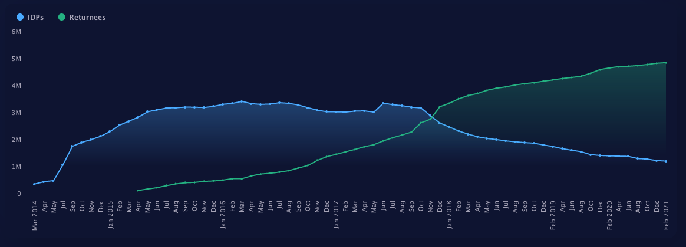
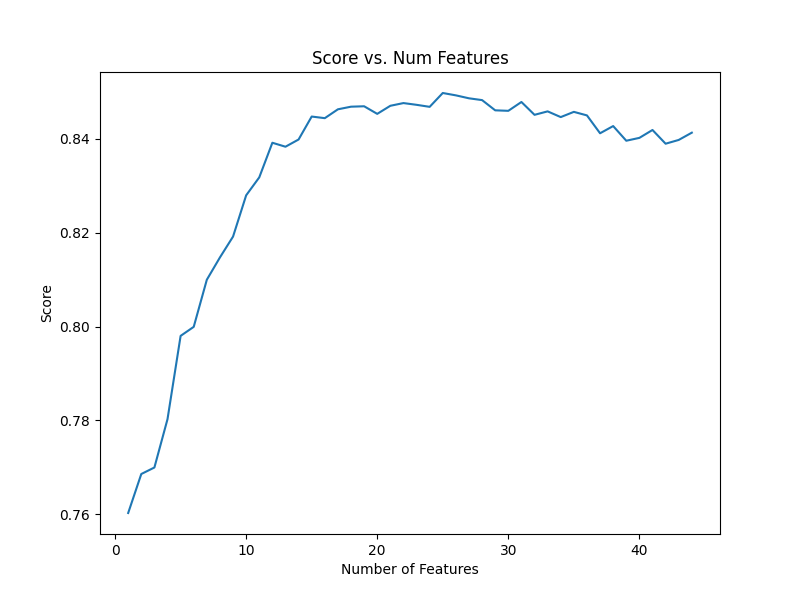
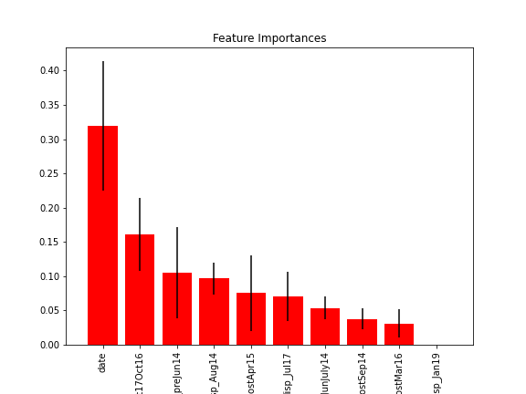

# Predicting Return of Iraqis from Displacement (2014-2020)

## Introduction

Displacement of populations during a military crisis is of major interest to humanitarian, military, and diplomatic organizations, particularly if this displacement is protracted. The ability to forecast the **number of households returning to a location or origin**  is useful as it allows organizations to better allocate scarce resources and organize logistics to support and protect displaced peoples. This project takes a machine learning approach using a Random Forest algorithm on displacement and event data. 

## Data sources

### Data on IDP outflows
The International Organization for Migration (IOM) has [extensive data tracking Iraqi IDP movements](http://iraqdtm.iom.int/). Specifically, this project used data on outgoing population flows that divided movements into roughly temporal displacement waves connected to military or political upheaval, i.e., "June 2016". Each row represented the location of origin for households, the distribution of households by current location at the Governorate level (roughly analagous to US State), distribution of households by shelter type, and date. 

### Data on IDP returns
The data on IDP returns also came from IOM and had a similar shape. However, each row represented the cumulative number of households returning to a specific place of origin, along with the distribution of which governorates they came from, what type of shelter they have in their place of origin, and the date. 

* Image of migrant outflows and returns over time:

### Data on Violent Events
This project integrated a dataset of geolocated data on violent events collected as part of [Uppsala University's Conflict Data Program](https://ucdp.uu.se/country/645). I decided to integrate this data because violence may precipitate population movement and the lack of violence (following displacement) may herald the return of IDPs. 

## Data Cleanup
A significant amount of cleanup was necessary, particularly to standardize different spellings of Arabic locations. Additionally, data from IOM took the form of hundreds of .xslx spreadsheets, so I wrote a script that converted them to csv's for faster concatenation in pandas. 

## Machine Learning Analysis and Results
A Random Forest Regressor was chosen owing to the algorithm's power, flexibility (number of hyperparameters), and interpretability. 

### Features
* **displaced_to:** The total number of households arriving at a location on a certain date. (May be negative in cases when households leave a location; does not imply that that household has returned to its place of origin)
* **est_death:** The estimated number of deaths from violent conflict in a place of origin on a certain date
* **disp_from_(Governorate):** The number of households originating in a specific Governorate (i.e., 25 households come from Anbar, 20 from Basrah)
* **out_(shelter_type):** The number of households in 13 specific types of shelter (i.e., camp, host family, informal settlement, school building, religious building, etc. )
* **date:** The date on which an event (displacement, return, deaths) took place; converted from datetime to ordinal values for analysis. 

### Default, first-pass
When the Random Forest regressor is run without any hyperparameter tuning, the score (R^2) is .8263 with an Out of Bag error score of .8476, suggesting there's low indiciation of overfitting the data. 

### Hyperparameter Tuning

* Number of Trees vs. Score 
The optimal number of trees is around 40. 

* Number of Features vs. Score
The optimal number of features-per-split is about 25. I used an EC2 instance to process this more quickly than my local machine: 

### Interpretation

Feature "importance" was gauged for the top 10 features below:

It is interesting that the date and waves of displacement were the most "important" features, rather than "estimated deaths". It could be that the the way this data was read in to the dataframe (at the district level) did not translate into a feature with significant predictive value. 

## Further Exploration
Areas for further exploration: 
* More careful integration of event data at a more granular level
* Classification algorithms of which governorate/distict IDP's go to 
* Statistics on average length of displacement by wave of migration (difficult to get at with the data as it currently is, which is not at the household level)