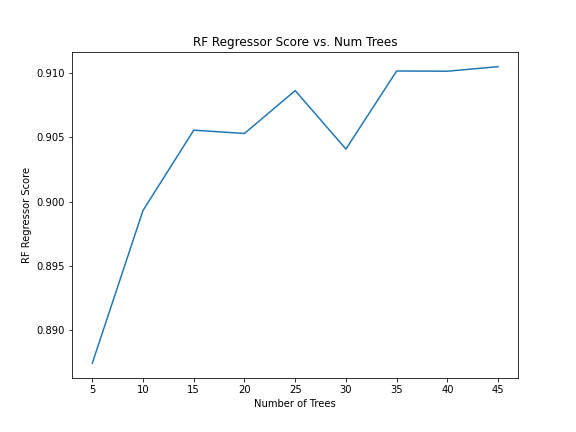

# Predicting Return of Iraqis from Displacement (2014-2020)

## Introduction

Displacement of populations during a military crisis is of major interest to humanitarian, military, and diplomatic organizations, particularly if this displacement is protracted. The ability to forecast the **number of households returning to a location or origin**  is useful as it allows organizations to better allocate scarce resources and organize logistics to support and protect displaced peoples. This project takes a machine learning approach using a Random Forest algorithm on displacement and event data. 

## Data sources

### Data on IDP outflows
The International Organization for Migration (IOM) has [extensive data tracking Iraqi IDP movements](http://iraqdtm.iom.int/). Specifically, this project used data on outgoing population flows that divided movements into different temporal displacement waves connected to military or political upheaval, i.e., "June 2016". Each row represented the location of origin for households, the distribution of households by current location at the Governorate level (roughly analagous to US State), distribution of households by shelter type, and date. 

### Data on IDP returns
This 

### Data on Violent Events
This project integrated a dataset of geolocated data on violent events collected as part of [Uppsala University's Conflict Data Program](https://ucdp.uu.se/country/645). I decided to integrate this data because violence may precipitate population movement and the lack of violence (following displacement) may herald the return of IDPs. 

## Data Cleanup
A significant amount of cleanup was necessary, particularly to standardize different spellings of Arabic locations. Additionally, data from IOM took the form of hundreds of .xslx spreadsheets, so I wrote a script that converted them to csv's for faster concatenation in pandas. 

## Machine Learning Analysis and Results

### Hyperparameter Tuning

* Number of Trees vs. Score

* Number of Features vs. Score

